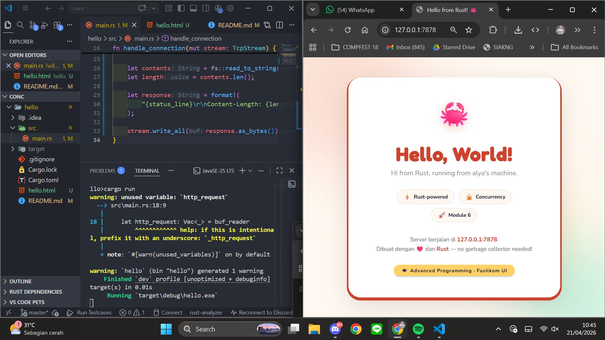
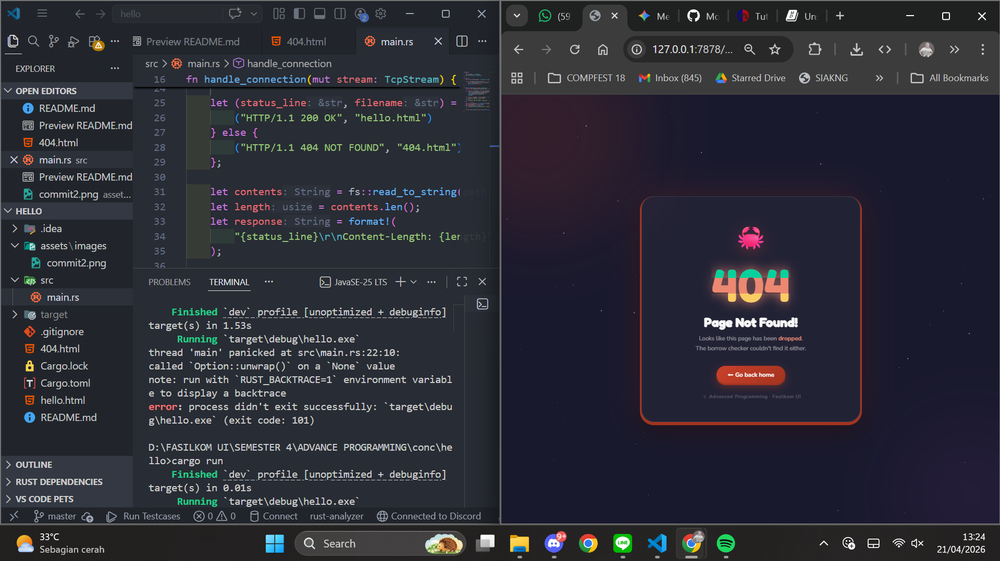

```
Nama    : Nisrina Alya Nabilah
Kelas   : Advanced Programming B
NPM     : 2406425924
```

# Tutorial Module 6 - Concurrency


## Commit 1 Reflection Notes

Pada milestone ini, saya mempelajari cara kerja `handle_connection`.
Method ini menerima `TcpStream` yang merupakan koneksi dari browser.
`BufReader` digunakan untuk membaca stream secara efisien baris per baris.
HTTP request diakhiri dengan baris kosong, sehingga `.take_while(|line| !line.is_empty())`
digunakan untuk mengumpulkan semua header. Hasilnya adalah Vec<String> berisi
semua header HTTP yang dikirim browser seperti method (GET), path, dan metadata lainnya.

## Commit 2 Reflection Notes



Pada milestone ini, server sekarang mengirimkan respon HTML ke browser.
`fs::read_to_string("hello.html")` digunakan untuk membaca isi file HTML dari disk.
HTTP response memiliki format: status line, diikuti header (termasuk Content-Length
yang memberitahu browser ukuran body), blank line sebagai pemisah, lalu body HTML.
`Content-Length` penting agar browser tahu kapan response selesai diterima.
`stream.write_all()` mengirimkan seluruh response sebagai bytes ke browser.

## Commit 3 Reflection Notes


Milestone ini menambahkan kemampuan server untuk membedakan request.
Request line pertama dari HTTP (misal "GET / HTTP/1.1") digunakan untuk
menentukan respons yang tepat. Refactoring dilakukan dengan memisahkan
logika keputusan (status_line dan filename) dari logika pengiriman response.
Hal ini penting karena tanpa refactoring, kode pengiriman akan terduplikasi
di setiap branch kondisi, melanggar prinsip DRY. Dengan refactoring,
kode lebih bersih dan mudah ditambahkan kondisi baru di masa depan.

## Commit 4 Reflection Notes

Milestone ini mendemonstrasikan kelemahan fundamental single-threaded server.
Ketika satu request membutuhkan waktu lama (disimulasikan dengan thread::sleep 10 detik),
seluruh server diblokir dan tidak bisa melayani request lain sampai request pertama selesai.
Ini terjadi karena loop `for stream in listener.incoming()` bersifat sequential —
satu stream harus selesai dihandle sebelum stream berikutnya diproses.
Dalam kasus nyata, ini bisa terjadi akibat query database lambat, I/O berat,
atau komputasi kompleks yang membuat semua pengguna lain menunggu.